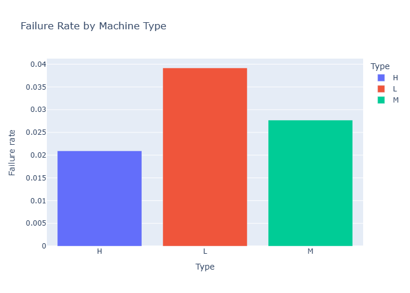
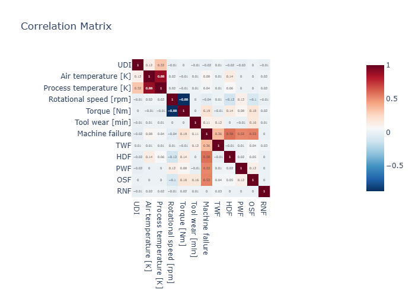

# AI Industrial Monitoring Platform

> AI platform for industrial anomaly detection and predictive maintenance.

## Objective

Predict machine failures from industrial sensor data
using the AI4I 2020 dataset (temperatures, rotational speed, torque).

## Tech Stack

| Category | Tools |
|----------|-------|
| Data & ML | Python · Pandas · Scikit-Learn · PyTorch |
| Dashboard | Streamlit |
| Backend | FastAPI |
| Database | PostgreSQL |
| MLOps | MLflow · Docker |
| Big Data | PySpark |

## Project Architecture

```text
ai-industrial-monitoring-platform/
├── data/
│   ├── raw/           # raw data (never modified)
│   └── processed/     # cleaned data
├── notebooks/         # exploration & EDA
├── src/
│   ├── preprocessing/
│   ├── training/
│   ├── inference/
│   └── visualization/
├── api/               # FastAPI
├── dashboard/         # Streamlit
├── models/            # saved models
├── outputs/           # charts and visualizations
└── tests/
```

## Visualizations

### Machine Type Distribution


### Failure Rate by Machine Type


### Failure Modes


### Correlation Matrix


## Status

🚧 Work in progress — Phase 1/6 (Python & GitHub)

## Roadmap

- [x] Phase 1 — Python & GitHub
- [ ] Phase 2 — Data Analysis & Dashboard
- [ ] Phase 3 — FastAPI + PostgreSQL
- [ ] Phase 4 — Docker & MLflow
- [ ] Phase 5 — PySpark
- [ ] Phase 6 — Portfolio & Applications