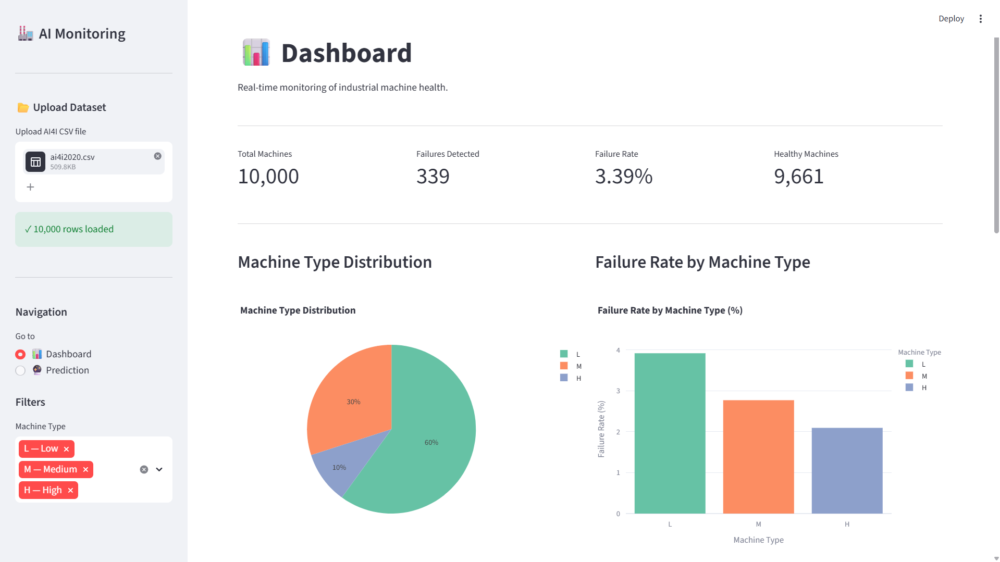
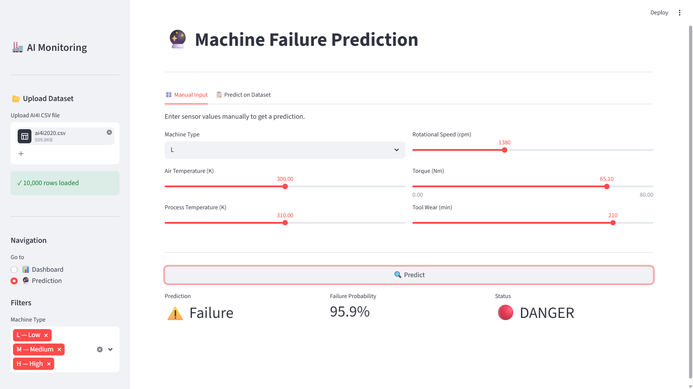
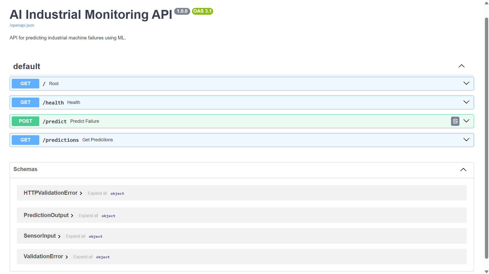
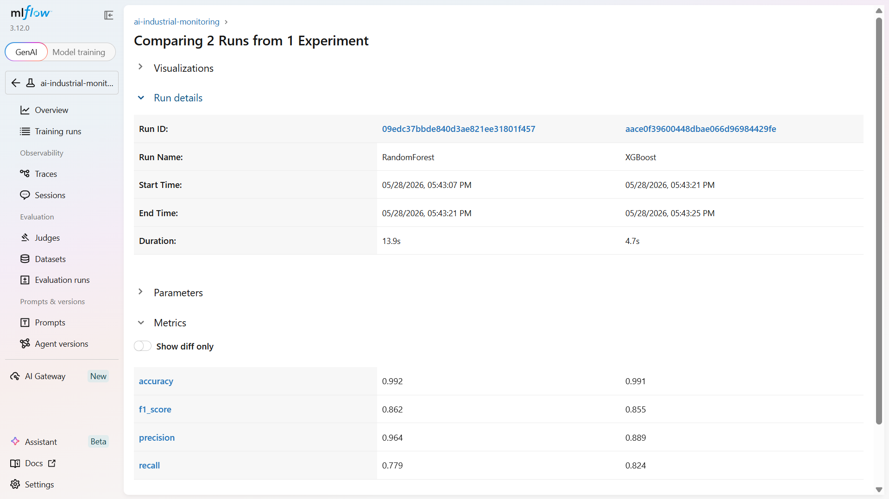

# AI Industrial Monitoring Platform

> End-to-end AI platform for industrial anomaly detection and predictive maintenance.

[](https://python.org)
[](https://fastapi.tiangolo.com)
[](https://streamlit.io)
[](https://docker.com)
[](https://mlflow.org)
[](LICENSE)

---

## Overview

AI-powered platform that analyzes industrial sensor data to **predict machine failures** before they occur.
Built on the AI4I 2020 Predictive Maintenance dataset (10,000 data points from a simulated milling machine).

**Best model : XGBoost — F1-Score 0.855 | Recall 0.824**

---

## Screenshots

### Dashboard — KPIs & Analytics


### Dashboard — Real-time Prediction


### REST API — Swagger UI


### MLflow — Experiment Tracking


---

## Tech Stack

| Category | Tools |
|----------|-------|
| Data & ML | Python · Pandas · Scikit-Learn · XGBoost |
| Dashboard | Streamlit · Plotly |
| Backend | FastAPI · Pydantic |
| Database | PostgreSQL · SQLAlchemy |
| MLOps | MLflow · Docker · Docker Compose |
| Big Data | PySpark |

---

## Project Architecture

```text
ai-industrial-monitoring-platform/
├── data/
│   ├── raw/                  # raw data (never modified)
│   └── processed/            # cleaned data + Spark output
├── notebooks/                # EDA notebook
├── src/
│   ├── preprocessing/        # cleaning pipeline + PySpark
│   ├── training/             # model training + MLflow
│   ├── inference/            # prediction module
│   └── visualization/
├── api/                      # FastAPI + PostgreSQL
├── dashboard/                # Streamlit app
├── models/                   # saved models
├── outputs/                  # screenshots & charts
└── tests/
```

---

## ML Results

| Model | F1-Score | Precision | Recall |
|-------|----------|-----------|--------|
| Logistic Regression | 0.296 | 0.178 | 0.882 |
| Random Forest | 0.862 | 0.964 | 0.779 |
| **XGBoost ✓** | **0.855** | **0.889** | **0.824** |

> XGBoost selected for best **recall (0.824)** — in industrial context, missing a failure is more costly than a false alarm.

---

## Quick Start

### With Docker (recommended)

```bash
git clone https://github.com/abdoudiallo-git/ai-industrial-monitoring-platform.git
cd ai-industrial-monitoring-platform
cp .env.example .env  # add your PostgreSQL password
docker-compose up --build
```

- Dashboard : http://localhost:8501
- API docs  : http://localhost:8000/docs

### Local installation

```bash
git clone https://github.com/abdoudiallo-git/ai-industrial-monitoring-platform.git
cd ai-industrial-monitoring-platform
python -m venv venv
venv\Scripts\activate  # Windows
pip install -r requirements.txt

# Run API
uvicorn api.main:app --reload

# Run Dashboard
streamlit run dashboard/app.py
```

---

## Features

- **Upload & Analyze** — upload any AI4I compatible CSV and get instant analysis
- **KPI Dashboard** — failure rates, sensor distributions, correlation matrix
- **ML Prediction** — predict machine failure from sensor values in real time
- **Batch Prediction** — run predictions on the full uploaded dataset
- **REST API** — FastAPI endpoints with automatic Swagger documentation
- **Data Storage** — all predictions stored in PostgreSQL with history
- **Experiment Tracking** — MLflow tracks metrics, parameters and models
- **Containerized** — full Docker Compose setup (API + Dashboard + PostgreSQL)
- **Big Data Pipeline** — PySpark distributed processing pipeline

---

## Future Improvements

- [ ] Multi-label classification for individual failure modes (TWF, HDF, PWF, OSF, RNF)
- [ ] Real-time streaming with Apache Kafka
- [ ] Cloud deployment on Azure
- [ ] CI/CD pipeline with GitHub Actions
- [ ] Unit tests coverage

---

## Status

✅ Complete — Phase 6/6 (Portfolio & Applications)

## Roadmap

- [x] Phase 1 — Python & GitHub
- [x] Phase 2 — Data Analysis & Dashboard
- [x] Phase 3 — FastAPI + PostgreSQL
- [x] Phase 4 — Docker & MLflow
- [x] Phase 5 — PySpark
- [x] Phase 6 — Portfolio & Applications

---

## Dataset

S. Matzka, *"Explainable Artificial Intelligence for Predictive Maintenance Applications"*,
2020 Third International Conference on Artificial Intelligence for Industries (AI4I), 2020.