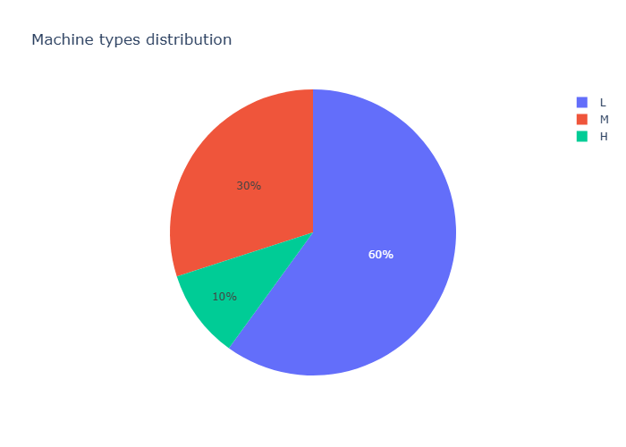
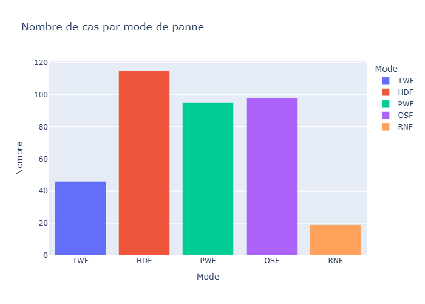
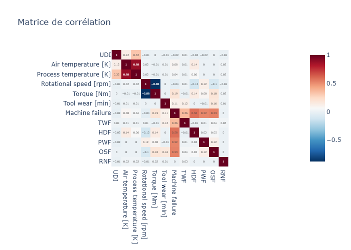

# AI Industrial Monitoring Platform

> Plateforme IA pour la détection d'anomalies industrielles et la maintenance prédictive.

## Objectif

Prédire les pannes machines à partir de données de capteurs industriels
en utilisant le dataset AI4I 2020 (températures, vitesse rotation, couple moteur).

## Stack technique

| Catégorie | Outils |
|-----------|--------|
| Data & ML | Python · Pandas · Scikit-Learn · PyTorch |
| Dashboard | Streamlit |
| Backend | FastAPI |
| Base de données | PostgreSQL |
| MLOps | MLflow · Docker |
| Big Data | PySpark |

## Architecture du projet

```text
ai-industrial-monitoring-platform/
├── data/
│   ├── raw/           # données brutes (jamais modifiées)
│   └── processed/     # données nettoyées
├── notebooks/         # exploration & EDA
├── src/
│   ├── preprocessing/
│   ├── training/
│   ├── inference/
│   └── visualization/
├── api/               # FastAPI
├── dashboard/         # Streamlit
├── models/            # modèles sauvegardés
└── tests/
```
## Visualisations

### Distribution des types de machines


### Taux de pannes par type de machine


### Modes de panne


### Matrice de corrélation


## Statut

🚧 En cours de développement — Phase 1/6 (Python & GitHub)

## Roadmap

- [x] Phase 1 — Python & GitHub
- [ ] Phase 2 — Data Analysis & Dashboard
- [ ] Phase 3 — FastAPI + PostgreSQL
- [ ] Phase 4 — Docker & MLflow
- [ ] Phase 5 — PySpark
- [ ] Phase 6 — Portfolio & Candidatures

